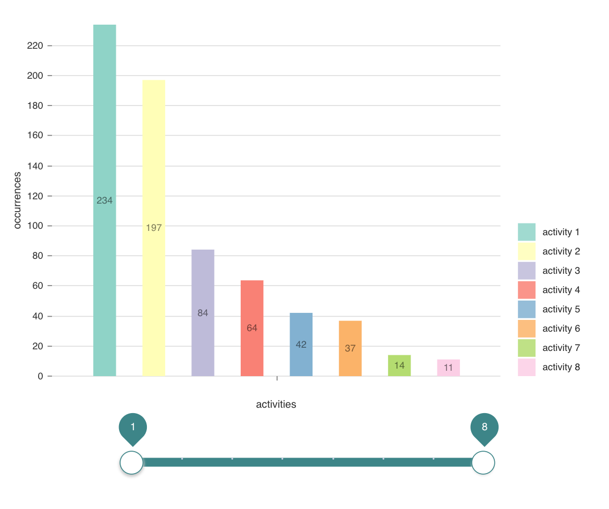

# Interplay of components and state management



## Introduction

- This project consists of two main components that interact to each other.
- The first component is a bar chart that displays how often each activity occurred in an array in order of their frequency.
- The second component is a slider that is used to filter the data shown in the bar chart.

## Installation and Use

- Download the files, cd into root directory and run:
```bash
# Install dependencies
$ npm install

# Run the app
$ npm start
```

## References

### Tutorials
- [Redux Crash Course With React](https://www.youtube.com/watch?v=93p3LxR9xfM) by Traversy Media.
- [React Redux with hooks](https://www.youtube.com/watch?v=_oK9Jd8LH1E) by Classsed.

### Articles 
- [Replacing Component Lifecycles with the useEffect Hook, in React](https://alligator.io/react/replacing-component-lifecycles-with-useeffect/)
- [How to Use Typescript with React and Redux](https://medium.com/@rossbulat/how-to-use-typescript-with-react-and-redux-a118b1e02b76)
- [Configuring Jest and Enzyme in Create React App on Typescript](https://thetrevorharmon.com/blog/configuring-jest-and-enzyme-in-create-react-app-on-typescript)

### Documentations
- [MDN Web Docs](https://developer.mozilla.org/en-US/)
- [W3 School](https://www.w3schools.com/)
- [Redux](https://redux.js.org/)
- [React](https://reactjs.org/)
- [React-Redux](https://react-redux.js.org)
- [Nivo](https://nivo.rocks/bar) 
- [Material-UI ](https://material-ui.com/pt/components/slider/)
- [Styled Components](https://www.styled-components.com/)
- [Typescript](https://www.typescriptlang.org/)
